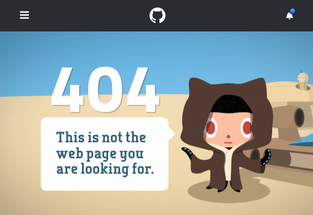

<a name="top"></a>

# 9. Домашнее задание к лекции «React Router»
[](https://ci.appveyor.com/project/igor-chazov/ra-hw-9-router-1-2-3) [[GithubPages](https://igor-chazov.github.io/ra-hw-9_router_1-2-3)]

---

**Перейти к:**  
***[9.2 CRUD](#9.2)  
[9.3 Authentication*](#9.3)***

---

## 9.1 Навигационное меню

Необходимо реализовать меню для сайта гоночного такси с пунктами «Главная», «Дрифт-такси», «Time Attack» и «Forza Karting». При переходе на страницу соответствующий пункт меню должен подсветиться:  


## Описание компонента

Компонент должен создавать HTML-разметку вида:
```html
<nav class="menu">
  <a class="menu__item" href="/">Главная</a>
  <a class="menu__item" href="/drift">Дрифт-такси</a>
  <a class="menu__item" href="/timeattack">Time Attack</a>
  <a class="menu__item" href="/forza">Forza Karting</a>
</nav>
```
Активный пункт меню помечается классом `menu__item-active`.

## Реализация

Необходимо реализовать компонет `Menu`.

Воспользуйтесь готовым файлом `App.js` и стилями `css/index.css` из данного каталога в качестве отправной точки (замените ими те, что создаются в create-react-app).

**Обратите внимание**: в файлах `App.js` расположено несколько компонентов не потому, что так нужно делать, а для вашего удобства (чтобы вам было удобнее копировать). Будет хорошо, если в своём решении вы разнесёте их по разным файлам.

---

## <a name="9.2">9.2 CRUD</a>
***[(наверх)](#top)***

Вам необходимо реализовать CRUD при работе с HTTP с использование Router'а.

Backend вы можете либо написать сами, либо взять готовый (из каталога `backend`).


Нас интересует только id, content и created, в качестве остальных значений (имя, фото) можете поставить заглушки.

## Общая механика

При нахождении на странице `/` отображается список существующих постов (GET на адрес http://localhost:7777/posts), полученные данные отображаются в виде карточек:


Кнопка "Создать пост" ведёт на страницу добавления (см. ниже) `/posts/new` (помните про регулярные выражения).

При клике на саму карточку происходит переход на страницу просмотра поста (см. ниже) `/posts/{postId}`.

### Страница создания

На странице создания `/posts/new` отображается карточка создания:


При нажатии на кнопку "Опубликовать", пост сохраняется (POST на адрес http://localhost:7777/posts body: `{"id": 0, "content": "То, что введено в поле ввода"}`), после чего осуществляется редирект на главную страницу.

При нажатии на крестик (в верхнем правом углу) происходит редирект на главную без сохранения (advanced: можете сохранить в localStorage и потом вытаскивать оттуда).

### Страница просмотра

На странице просмотра `/posts/{id}` отображается краточка просмотра:


При клике на кнопку "Удалить" происходит удаление поста (DELETE на адрес http://localhost:7777/posts/{id}), после чего осуществляется редирект на главную страницу.

При клике на кнопку "Редактировать" карточка просмотра заменяется карточкой редактирования:


На карточке редактирования:
* кнопка сохранить приводит к сохранению поста (POST на адрес http://localhost:7777/posts body: `{"id": не 0, "content": "То, что введено в поле ввода"}`) и  отображению карточки просмотра (с обновлёнными данными).
* кнопка крестик приводит к возврату к карточки просмотра.

**Важно**:

1. Не смотрите на то, как это реализовано на фейсбуке - механика изменена
1. Но вы можете подглядеть как пользователю отображается загрузка (сетевые операции добавления/сохранения/удаления)
1. React Router позволяет использовать регулярные выражения в роутах: https://github.com/pillarjs/path-to-regexp/tree/v1.7.0

---

## <a name="9.3">9.3 Authentication*</a>
***[(наверх)](#top)***

Вы решили модернизировать систему с аутентификацией, используя знания, полученные о роутере.

Используя сервер, расположенный в каталоге `backend`, реализуйте следующее приложение, удовлетворяющее следующим условиям:

1. При первой загрузке показывается Landing-страница с формой входа (url = /):


2. После авторизации (POST http://localhost:7070/auth `{"username": "vasya", "password": "vasya"}`), загружаются компонент ленты новостей и в тулбаре отображается профиль с кнопкой выйти (url = /news):


Для запроса профиля используйте запрос вида:
```
GET http://localhost:7070/private/me
Authorization: Bearer <ваш_токен>
```

Для запроса новостей используйте запрос вида:
```
GET http://localhost:7070/private/news
Authorization: Bearer <ваш_токен>
```

3. При нажатии на кнопку выйти URL происходит редирект на главную страницу (url = /)

4. Каждая новость кликабельна, при клике на новость открывается страница, на которой показана только карточка этой новости (url = /news/{id}) 

5. Если пользователь не аутентифицирован, то попытка зайти на /news или /news/{id} должна приводить к редиректу на главную страницу (url = /)

Важно:
1. Профиль и токен должны храниться в localStorage/sessionStorage (при перезагрузке страницы должна так же загружаться лента новостей, если мы аутентифицированы)
1. Должна быть обработка ошибок, если получена ошибка 401 - то нужно разлогинивать пользователя (удалять всё из localStorage/sessionStorage)
1. Должна быть обработка ошибок, если получена ошибка 404 (например, пользователь в аутентифицированном режиме вручную вбил в адресную строку /news/00000000-0000-0000-0000-000000000000), то должна отрисовываться страница 404 - просто тулбар + большими буквами Not Found, например, как на GitHub:



---

